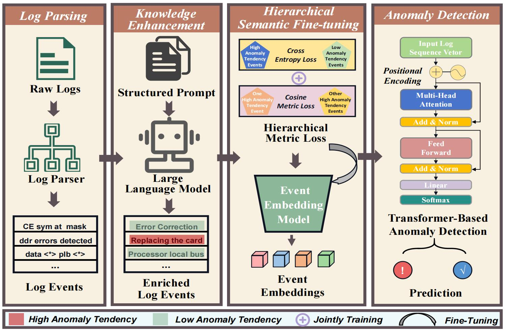

# 🔥LLMeLog: An Approach for Anomaly Detection based on LLM-enriched Log Events



This is the basic implementation of our paper in ISSRE 2024 (Research Track): **LLMeLog: An Approach for Anomaly Detection based on LLM-enriched Log Events**

- [LLMeLog](#llmelog)
  * [Project Structure](#project-structure)
  * [Datasets](#datasets)
  * [Environment](#environment)
  
  - [Preparation](#preparation)
  
  - [Quick Start](#quick-start)

## 📌 Description

Log-based anomaly detection is an essential task in maintaining software reliability. Existing log-based anomaly detection approaches often consist of three key phases: log parsing, event embedding, and model construction. Event embedding efficiently extracts semantic information from log events and produces vector representations of log events. However, existing event embedding methods suffer from two key problems. First, semantic noises are buried in log events leading to inevitable gaps between the obtained semantics from log events and their essential meanings. Second, there exists a gap between general semantic embedding and the specific embedding requirement of anomaly detection tasks. To mitigate these problems and improve the quality of representations of log events, we propose a novel anomaly detection approach named LLMeLog. It leverages the capabilities of large language models (LLMs) to enrich the contents of log events with in-context learning techniques. Then it utilizes the enriched log events to fine-tune a pre-trained BERT model. At last, it trains a transformer-based anomaly detection model with the event representations produced by the pre-trained BERT model. Evaluation results on three public log datasets show that LLMeLog achieves the best performance across all datasets, boasting F1-scores exceeding 99%. Besides, when using only 10% of labeled data as training data, our approach can still achieve over 90% F1-scores.

## 🔍 Project Structure

```
├─checkpoint      # Saved models
├─bert-base-en    # Pretrained BERT model
├─new_encoder     # Fine-tuned BERT model
├─data            # Log data
├─src             
|  ├─dataset.py   # Load dataset
|  ├─models.py    # Transformer-Based Anomaly Detection model   
|  └─utils.py     # Log Embedding
├─main.py         # entries
└─predata.py      # Data preprocess
```

## 📑 Datasets

We used `3` open-source log datasets for evaluation, HDFS, BGL and Thunderbird. 

| Software System | Description                        | Time Span  | # Messages | Data Size | Link                                                      |
|       ---       |           ----                     |    ----    |    ----    |  ----     |                ---                                        |
| HDFS         | Hadoop distributed file system log | 38.7 hours | 11,175,629 | 1.47GB | [Loghub](https://github.com/logpai/loghub/tree/master/HDFS) |
| BGL           | Blue Gene/L supercomputer log | 214.7 days | 4,747,963 | 708.76MB | [Usenix-CFDR Data](https://www.usenix.org/cfdr-data#hpc4) |
| Thunderbird     | Thunderbird supercomputer log      | 244 days   | 211,212,192 | 27.367  GB | [Usenix-CFDR Data](https://www.usenix.org/cfdr-data#hpc4)   |

**Note:** Considering the huge scale of the Thunderbird dataset, we followed the settings of the previous study [LogADEmpirical](https://github.com/LogIntelligence/LogADEmpirical) and selected the earliest 10 million log messages from the Thunderbird dataset for experimentation. 

## ⚙️ Environment

**Key Packages:**

Numpy==1.20.3

Pandas==1.3.5

Pytorch_lightning==1.1.2

torch==1.13.1+cu116

tqdm==4.62.3

transformers==4.15.0

[Drain3](https://github.com/IBM/Drain3)


## 📜 Preparation

You need to follow these steps to **completely** run `LLMeLog`.
- **Step 1:** Download [Log Data](https://github.com/logpai/loghub) and put it under `data` folder.
- **Step 2:** Using [Drain](https://github.com/IBM/Drain3) to parse the unstructed logs.
- **Step 3:** Download `bert-base` from [Hugging Face](https://huggingface.co/bert-base-uncased), and put it under `bert-base-en` folder.
- **Step 4:** Enriching the log event with the provided prompt, we recommend using [ChatGPT](https://chat.openai.com/).


## 🚀 Quick Start
you can run `LLMeLog` on HDFS dataset with this code:

#### 👉 **Stage 1:** Preprocessing data for training and evaluation.

```
python predata.py --dataset hdfs
```

#### 👉 **Stage 2:** Hierarchical Semantic Fine-tuning.

```
python main.py --mode train --encoder 1 --dataset hdfs --lr 0.0002
```

#### 👉 **Stage 3:** Event Embedding within Fine-tuned BERT.

```
python main.py --mode gen --encoder 1 --dataset hdfs --lr 0.0002
```

#### 👉 **Stage 4:** Training Transoformer for Log-based Anomaly Detection.

```
python main.py --mode train --dataset hdfs --batch_size 256 --lr 0.0003
```

#### 👉 **Stage 5:** Evaluation on HDFS Dataset.

```
python main.py --mode eval --dataset hdfs --batch_size 256 --lr 0.0003 --load_checkpoint True
```

## 📝 Citation and Reference

If you find this paper useful, please consider staring 🌟 this repo and citing 📑 our paper:

```
@inproceedings{he2024llmelog,
  title={LLMeLog: An Approach for Anomaly Detection based on LLM-enriched Log Events},
  author={He, Minghua and Jia, Tong and Duan, Chiming and Cai, Huaqian and Li, Ying and Huang, Gang},
  booktitle={2024 IEEE 35th International Symposium on Software Reliability Engineering (ISSRE)},
  pages={132--143},
  year={2024},
  organization={IEEE}
}
```

 


